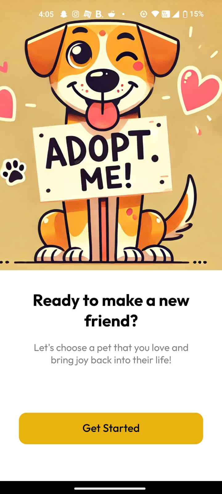
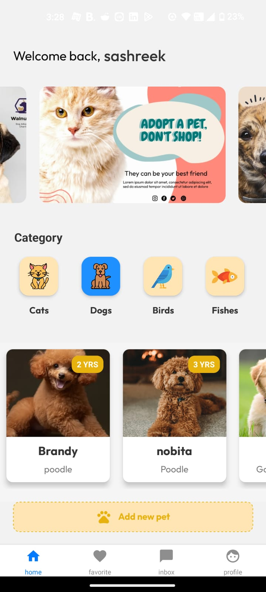
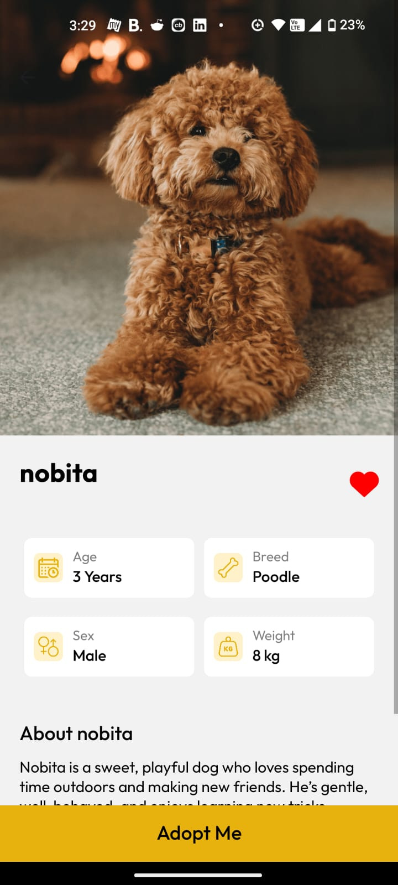
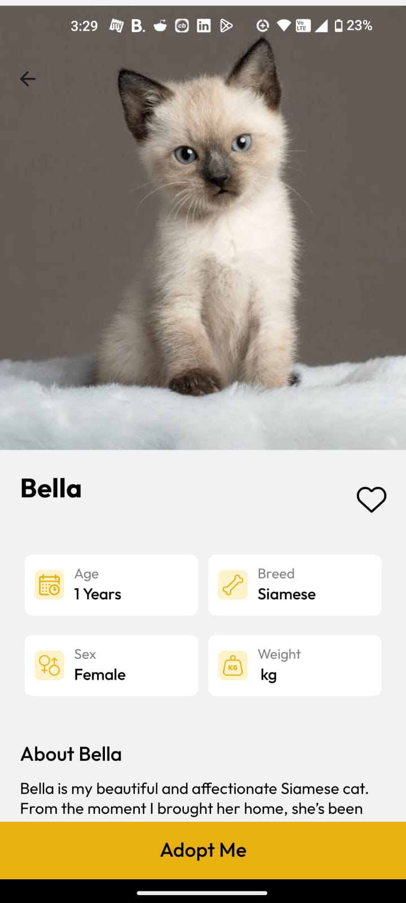
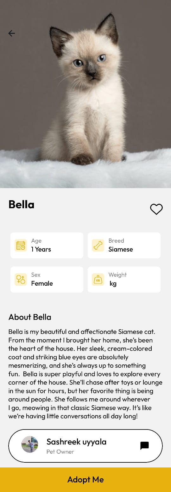
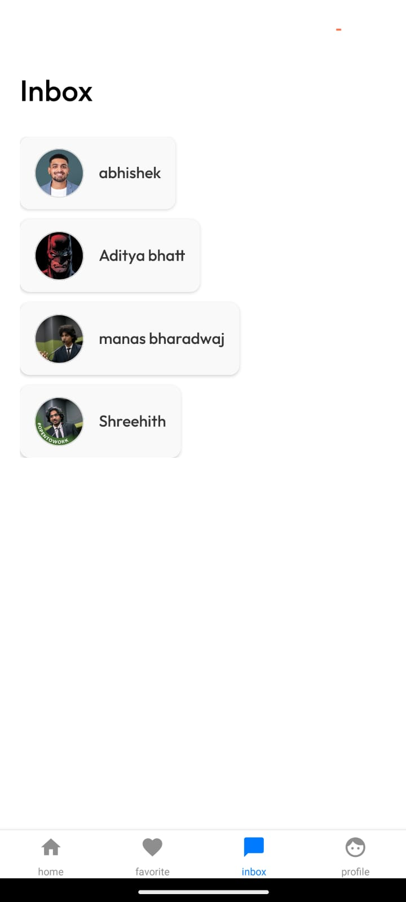
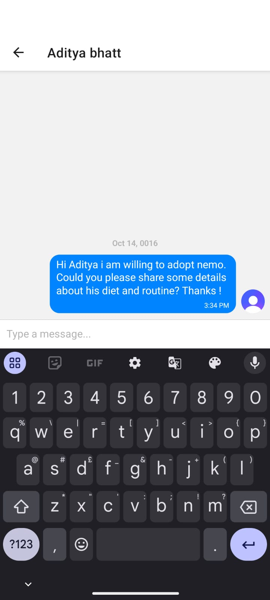
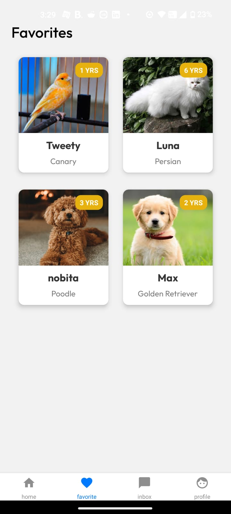
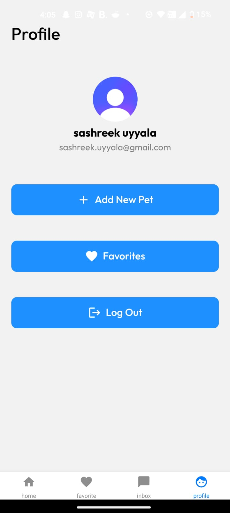

<h1 align="center">Pet Quest</h1>

  

## Introduction

PetQuest - Find Your Perfect Companion

PetQuest is a comprehensive platform that connects potential pet owners with the perfect pets. Browse available pets, chat with their owners, and mark your favorites. Whether you're looking for a furry friend or just exploring, PetQuest helps you find your next companion.

## Requirements

- NPM (Node Package Manager)
- React-Native
- Expo

## Features

- Browse different types of pets available for adoption
- Chat with pet owners to inquire about pets
- Mark pets as favorites
- Add new pets to the platform (for owners)
- View pets you've marked as favorites
- Clean and professional UI for easy navigation

## Setup

Install all packages

> npm install

## Screenshots

  
    
    &nbsp;&nbsp;&nbsp;&nbsp;
    
  

  
     &nbsp;&nbsp;&nbsp;&nbsp;
     &nbsp;&nbsp;&nbsp;&nbsp;
  

  

      &nbsp;&nbsp;&nbsp;&nbsp;
    
      &nbsp;&nbsp;&nbsp;&nbsp;
    
    
  

  
     &nbsp;&nbsp;&nbsp;&nbsp;
    
    &nbsp;&nbsp;&nbsp;&nbsp;
    
    &nbsp;&nbsp;&nbsp;&nbsp;
     &nbsp;&nbsp;&nbsp;&nbsp;
  

  
    
  

